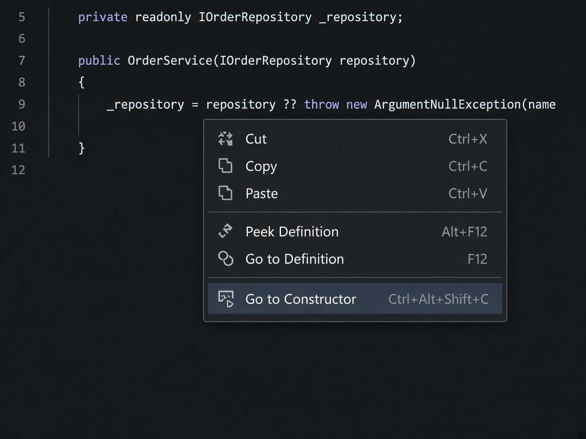
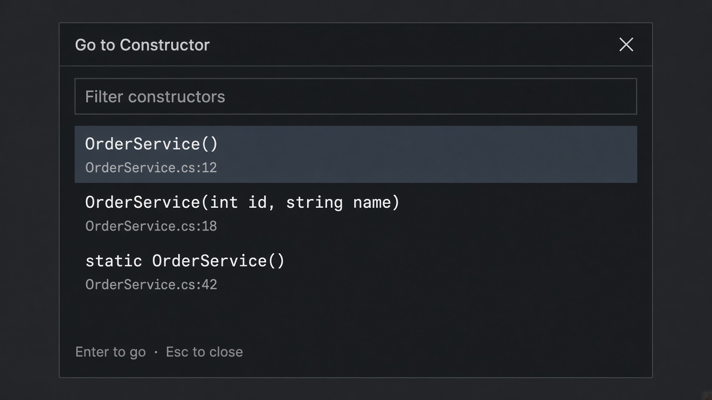
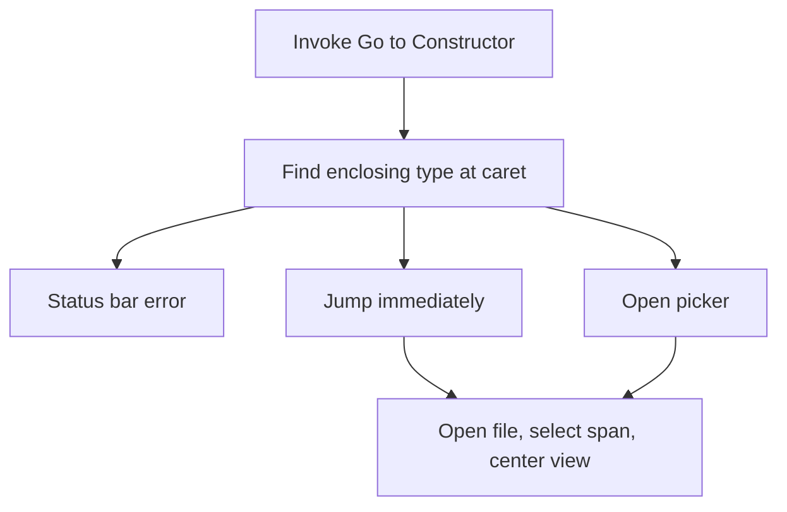

# Quick2Constructor

**English** | [简体中文](README.zh-CN.md)

<p align="center">
  
</p>

**Quick jump to constructor.**

From anywhere inside a C# type, jump the caret to that type’s constructor(s)—no Solution Explorer, no Find All References, no scrolling through a large file.

## Features

- **Keyboard shortcut:** `Ctrl+Alt+Shift+C` in the text editor
- **Editor context menu:** right-click → **Go to Constructor**
- **One constructor:** jump immediately and center it in the viewport
- **Several constructors:** a filterable picker (signature + `FileName:line`)
- **Partial types:** opens the file that actually declares the constructor
- **Instance and static constructors,** including `record` / `class` primary constructors
- **English and Chinese UI** that follows Visual Studio’s language

## Requirements

| | |
| --- | --- |
| IDE | Visual Studio 2022 (17.x) |
| Language | C# (`.cs` files) |
| Workspace | The file must belong to a Roslyn solution (a typical open project/solution) |

The command is **hidden and disabled** on non-C# documents.

## Install

1. Open `Quick2Constructor.sln` in Visual Studio 2022 and build the **Quick2Constructor** project.
2. Install the generated `.vsix` from the project output folder:
   - Double-click the `.vsix`, or
   - **Extensions → Manage Extensions → ⚙ → Install from VSIX…**
3. Restart Visual Studio when prompted.

## Usage

### 1. Place the caret inside a type

Open a `.cs` file and put the caret **inside** a `class`, `struct`, or `record`—in a method, property, field, nested type, or anywhere else in that type’s body. The enclosing type at the caret is what the command uses.

### 2. Invoke **Go to Constructor**

Use either:

- **`Ctrl+Alt+Shift+C`**, or
- Right-click in the editor and choose **Go to Constructor**



### 3. One constructor — jump immediately

If the type has a single explicit constructor, the extension:

1. Opens the file that declares it (this may be another partial-class file).
2. Moves the caret to the constructor **identifier**, or to the **parameter list** for a primary constructor.
3. Selects that span and **centers** it in the editor.

### 4. Several constructors — pick from the list

If there is more than one constructor, a picker opens:



| Action | Result |
| --- | --- |
| Type in **Filter constructors** | Filters by signature or `FileName:line` (case-insensitive) |
| **Enter** or **double-click** | Jump to the selected constructor |
| **Esc** or **×** | Close without navigating |
| **Down** from the filter | Move focus into the list |
| **Up** at the top of the list | Return focus to the filter |

Signatures look like the declarations themselves, for example:

```text
OrderService()
OrderService(int id, string name)
static OrderService()
```

`ref`, `out`, `in`, and `params` prefixes are included when present. Each row also shows `FileName:line`.

### 5. When it cannot jump

Failures are reported on the **Visual Studio status bar** (not as a dialog):

| Situation | Message |
| --- | --- |
| Not a C# file | Use Go to Constructor in a C# file. |
| No active editor | No active code editor. |
| File not in the solution | The current file is not in the Roslyn solution. |
| Caret is outside any type | The caret is not inside a type. |
| No explicit constructor | Type {0} has no explicit constructor. |
| Cannot open the target file | Unable to open the constructor file. |
| Location is stale | The constructor location is no longer valid. |

If the filter matches nothing, the picker shows **No matching constructors**.

## What it finds

The command collects:

- **Explicit instance constructors** (compiler-generated default constructors are skipped)
- **Static constructors**
- **Primary constructors** on `class` / `record` types (navigation targets the parameter list)

It does **not** jump to implicit default constructors. If a type only has the compiler-generated one, you get the “no explicit constructor” status message.

## Limitations

- C# only (`.cs`)
- The caret must be inside a type
- The document must be in the Roslyn workspace
- There is no options page; shortcut, menu, and picker behavior are fixed

## How it works


