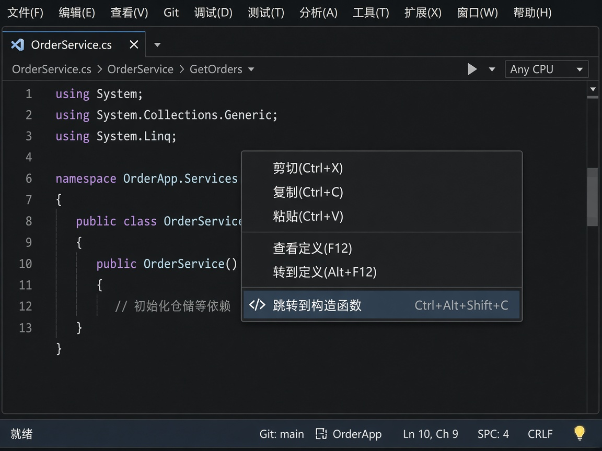
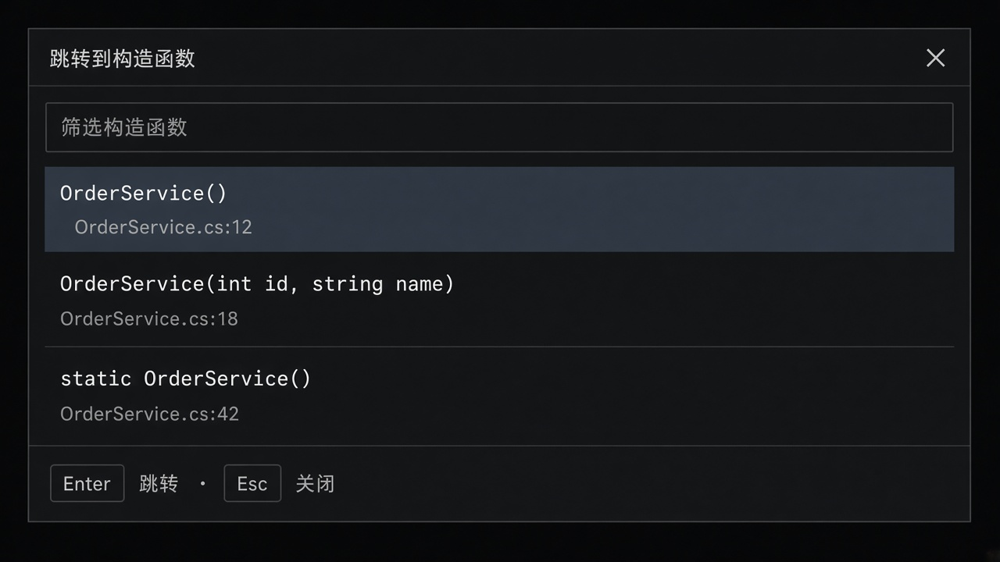
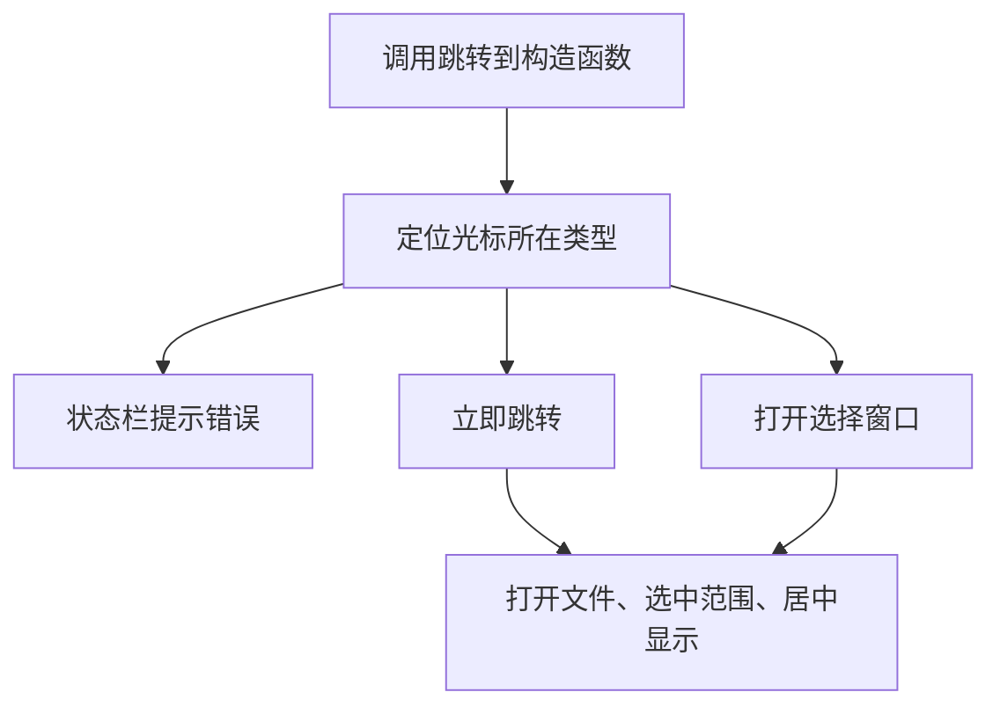

# Quick2Constructor

[English](README.md) | **简体中文**

<p align="center">
  
</p>

**快速跳转到构造函数。**

在 C# 类型内部任意位置，一键把光标跳到该类型的构造函数——不用翻 Solution Explorer、不用“查找所有引用”，也不用在大文件里来回滚。

## 功能

- **快捷键：** 文本编辑器中 `Ctrl+Alt+Shift+C`
- **编辑器右键菜单：** 右键 → **跳转到构造函数**
- **只有一个构造函数：** 立即跳转，并在视口中居中
- **多个构造函数：** 可筛选的选择窗口（签名 + `文件名:行号`）
- **分部类型：** 打开真正声明该构造函数的文件
- **实例构造函数与静态构造函数**，含 `record` / `class` 主构造函数
- **中英文界面**，跟随 Visual Studio 的显示语言

## 环境要求

| | |
| --- | --- |
| IDE | Visual Studio 2022（17.x） |
| 语言 | C#（`.cs` 文件） |
| 工作区 | 文件必须属于 Roslyn 解决方案（常规已打开的项目/解决方案） |

在非 C# 文档中，该命令会**隐藏且不可用**。

## 安装

1. 用 Visual Studio 2022 打开 `Quick2Constructor.sln`，生成 **Quick2Constructor** 项目。
2. 从项目输出目录安装生成的 `.vsix`：
   - 双击 `.vsix`，或
   - **扩展 → 管理扩展 → ⚙ → 从 VSIX 安装…**
3. 按提示重启 Visual Studio。

## 用法

### 1. 把光标放在类型内部

打开 `.cs` 文件，将光标放在 `class`、`struct` 或 `record` **内部**——方法、属性、字段、嵌套类型，或该类型体中的任意位置即可。命令以光标所在的外围类型为准。

### 2. 调用 **跳转到构造函数**

任选其一：

- **`Ctrl+Alt+Shift+C`**
- 在编辑器中右键，选择 **跳转到构造函数**



### 3. 只有一个构造函数 — 立即跳转

类型只有一个显式构造函数时，扩展会：

1. 打开声明该构造函数的文件（可能是另一个分部类文件）。
2. 把光标移到构造函数的 **标识符**；主构造函数则定位到 **参数列表**。
3. 选中该范围，并在编辑器中 **垂直居中**。

### 4. 多个构造函数 — 从列表中选择

存在多个构造函数时，会弹出选择窗口：



| 操作 | 效果 |
| --- | --- |
| 在 **筛选构造函数** 中输入 | 按签名或 `文件名:行号` 筛选（不区分大小写） |
| **Enter** 或 **双击** | 跳转到当前选中的构造函数 |
| **Esc** 或 **×** | 关闭窗口，不跳转 |
| 筛选框中按 **Down** | 焦点移到列表 |
| 列表顶部按 **Up** | 焦点回到筛选框 |

签名与声明本身一致，例如：

```text
OrderService()
OrderService(int id, string name)
static OrderService()
```

如有 `ref`、`out`、`in`、`params` 前缀会一并显示。每一行还会显示 `文件名:行号`。

### 5. 无法跳转时

失败信息显示在 **Visual Studio 状态栏**（不会弹出对话框）：

| 情况 | 提示 |
| --- | --- |
| 不是 C# 文件 | 请在 C# 文件中使用“跳转到构造函数”。 |
| 没有活动编辑器 | 没有活动的代码编辑器。 |
| 文件不在解决方案中 | 当前文件不在 Roslyn 解决方案中。 |
| 光标不在类型内 | 光标不在类型内部。 |
| 没有显式构造函数 | 类型 {0} 没有显式构造函数。 |
| 无法打开目标文件 | 无法打开构造函数所在文件。 |
| 位置已失效 | 构造函数位置已失效。 |

筛选无结果时，选择窗口显示 **没有匹配的构造函数**。

## 会找到哪些构造函数

命令收集：

- **显式实例构造函数**（跳过编译器生成的默认构造函数）
- **静态构造函数**
- `class` / `record` 的 **主构造函数**（跳转到参数列表）

**不会**跳转到隐式默认构造函数。若类型只有编译器生成的那一个，状态栏会提示“没有显式构造函数”。

## 限制

- 仅支持 C#（`.cs`）
- 光标必须在类型内部
- 文档必须位于 Roslyn 工作区
- 没有选项页；快捷键、菜单与选择窗口行为固定

## 工作流程


